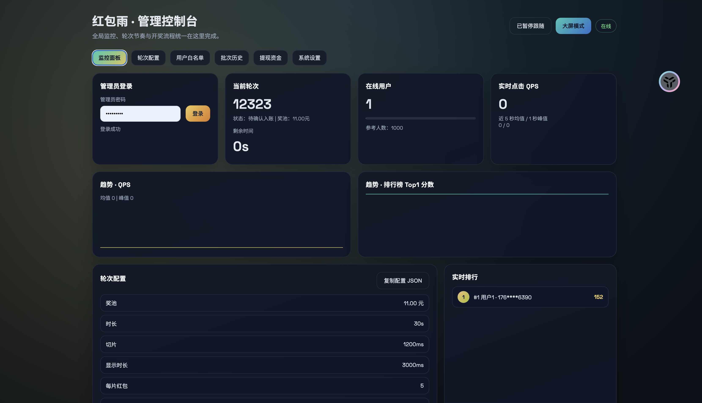
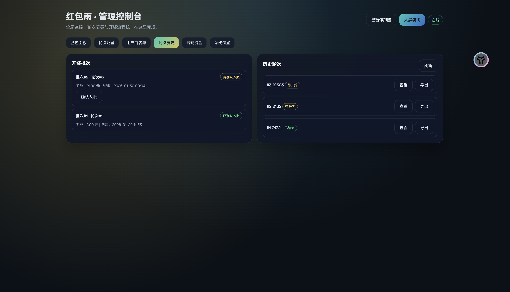

# 年会红包雨（基础说明）

## 项目简介
这是一个年会活动红包雨系统，面向高并发、实时互动与低延迟场景，提供用户登录、红包雨游戏、排行/开奖、钱包与提现等功能。后端使用 Go + Gin，数据持久化为 MySQL，实时状态与会话使用 Redis，并集成短信服务与支付宝转账。

关键词：高并发、实时互动、低延迟、WebSocket、红包雨

并发能力（参考）：在 macOS M1 环境、派对模式下实测 QPS 可达 4000+，可支撑 1000 人以上同时进行游戏。

## 目录结构
- `cmd/server`：主服务入口（HTTP + WebSocket）。
- `cmd/withdraw_worker`：提现后台任务入口。
- `internal/`：核心业务模块（配置、鉴权、游戏、支付、短信等）。
- `web/`：前端 HTML 页面（嵌入到二进制）。
- `docs/`：API 与数据库结构说明。
- `dist/`：构建产物示例（可选）。

## 快速开始
1. 准备依赖
   - Go 1.21
   - MySQL 5.7+ / 8.0+
   - Redis 6+
2. 初始化数据库
   - 创建数据库并导入 `docs/schema.sql`
3. 配置环境变量
   - 复制 `.env.example` 为 `.env` 并填写敏感项
4. 运行服务
   - `go run ./cmd/server`
5. 可选：提现后台任务
   - `go run ./cmd/withdraw_worker`

## 常用入口
- 首页：`/`
- 管理台：`/admin`
- 钱包：`/wallet`
- 提现：`/withdraw`
- WebSocket：`/ws`
- 健康检查：`/healthz`

## 关键配置
配置集中在 `.env`，示例与说明见 `.env.example`。重要项包括：
- `JWT_SECRET`：JWT 签名密钥
- `ADMIN_PASSWORD` / `ADMIN_TOKEN`：管理员登录
- `SUBMAIL_*`：短信服务
- `ALIPAY_*`：支付宝转账配置
- `WITHDRAW_*`：提现策略与开关
- `INTRO_BGM_URL` / `GAME_BGM_URL`：前端背景音乐资源地址（由 `/api/assets` 返回）

## 文档索引
- API 清单：`docs/api.md`
- 数据库结构：`docs/schema.sql`
- 生产部署：`docs/production.md`
- 运行详情截图：`Imgs/`

## 运行截图






## 高并发真实压测脚本
脚本路径：`/Users/lichen/年会红包雨/scripts/simulate_clients.py`（相对路径 `scripts/simulate_clients.py`）。  
用途：模拟真实用户的远程注册、WebSocket 连接、轮次轮询与点击行为，用于高并发真实压测。

### 调用方式
推荐使用 `uv`（脚本内置 PEP 723 依赖声明，自动安装 `aiohttp`）：
```bash
uv run scripts/simulate_clients.py \
  --base http://127.0.0.1:8080 \
  --remote-key <REMOTE_API_KEY> \
  --concurrency 500
```
若不使用 `uv`，需先安装依赖：
```bash
python3 -m pip install aiohttp
python3 scripts/simulate_clients.py --base http://127.0.0.1:8080 --remote-key <REMOTE_API_KEY> --concurrency 500
```

### 关键参数
- `--base`：HTTP 基础地址（如 `http://127.0.0.1:8080`）
- `--ws`：WebSocket 地址（可选，不填自动由 `--base` 推导）
- `--accounts`：账号文件（默认 `accounts.txt`）
- `--concurrency`：并发用户数（不填会交互询问）
- `--remote-key`：远程注册密钥（对应 `REMOTE_API_KEY`）
- `--sign-secret`：点击签名密钥（启用 `GAME_SIGN_SECRET` 时必填）
- `--poll-ms`：轮次轮询间隔（毫秒）
- `--click-prob`：每个红包的点击概率（0~1）
- `--reaction-min` / `--reaction-max`：模拟反应时间范围（毫秒）
- `--max-clicks`：每个用户最大点击次数（0=不限制）
- `--register-batch`：并发注册请求数
- `--verbose`：输出详细日志

### 账号文件格式
`accounts.txt` 每行格式：
```
phone,nickname,avatar_url
```
脚本会自动补足账号数量并写回文件（不足并发数时自动生成随机手机号）。
